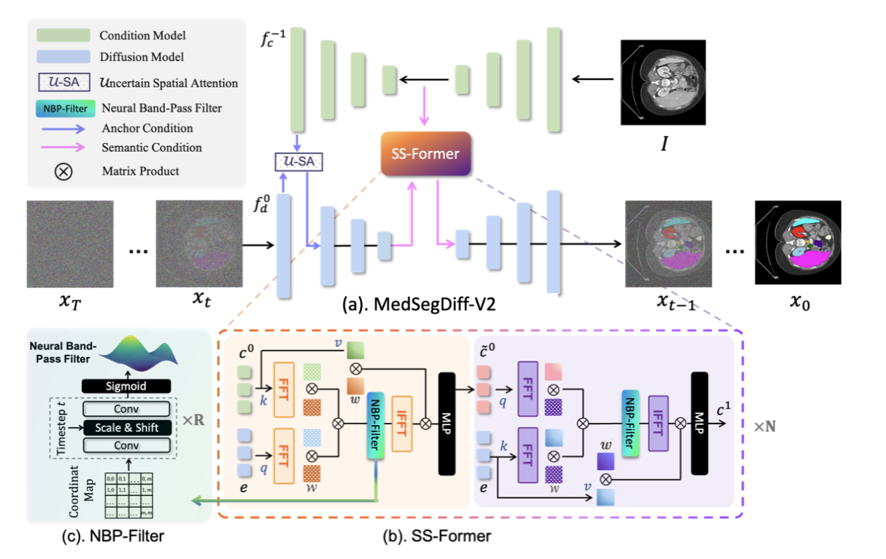
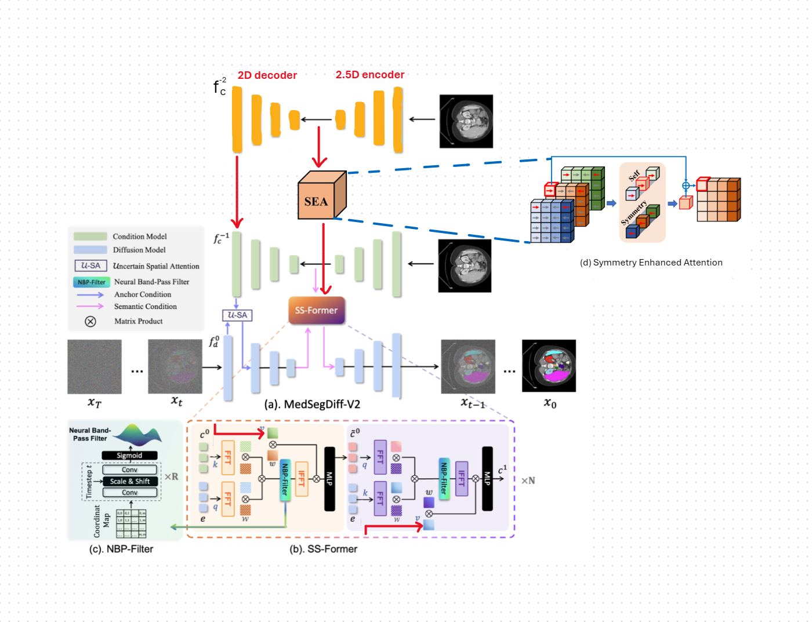

# MedDiffSeg

An improved implementation of [MedSegDiff](https://github.com/ImprintLab/MedSegDiff) — a diffusion-based framework for medical image segmentation.

| MedSegDiff (Original) | MedDiffSeg (This Project) |
| :---: | :---: |
| [ImprintLab/MedSegDiff](https://github.com/ImprintLab/MedSegDiff) | Modular codebase, multi-GPU, FP16, YAML config |
|  |  |

## Key Improvements

- **Modular architecture** — models, datasets, and utilities cleanly separated
- **YAML configuration** — declarative training configs in `configs/`
- **Multi-GPU training** — data-parallel training across multiple GPUs
- **FP16 inference** — memory-efficient sampling with automatic monkey-patching
- **Multiple datasets** — BRATS (2D/3D), ISIC, BTCV, and custom datasets supported

## Project Structure

```
MedDiffSeg/
├── configs/                  # YAML training configurations
│   └── train_brats.yaml
├── guided_diffusion/         # Core library
│   ├── models/               # Network architectures
│   │   ├── base_blocks.py    # Attention, ResBlock, QKV, etc.
│   │   ├── condition_net.py  # GenericUNet, SS_Former
│   │   ├── legacy.py         # UNetV1, UNetNew, EncoderUNetModel
│   │   └── medsegdiff_v2.py  # MedSegDiff V2 model
│   ├── data/                 # Dataset loaders
│   │   ├── brats_dataset.py  # BRATS 2D & 3D
│   │   ├── isic_dataset.py   # ISIC skin lesion
│   │   ├── btcv_dataset.py   # BTCV multi-organ
│   │   └── custom_dataset.py # Custom dataset template
│   ├── gaussian_diffusion.py # Diffusion process
│   ├── script_util.py        # Model/diffusion factory functions
│   ├── train_util.py         # Training loop
│   └── ...                   # Utilities (logging, losses, FP16, etc.)
├── scripts/                  # Entrypoints
│   ├── train.py              # Training script
│   ├── sample.py             # Sampling / inference
│   ├── sample_lowmem.py      # Low-memory sampling (large 3D volumes)
│   ├── evaluate.py           # Evaluation (Dice, IoU)
│   ├── evaluate_per_class.py # Per-class evaluation metrics
│   └── train_dual_gpu.sh     # Multi-GPU training launcher
├── tests/                    # Smoke tests
├── pyproject.toml
├── requirements.txt
└── requirements-dev.txt
```

## Installation

```bash
# Clone the repository
git clone https://github.com/hoangtung386/MedDiffSegment.git
cd MedDiffSegment

# Create a virtual environment
python -m venv venv
source venv/bin/activate

# Install dependencies
pip install -r requirements.txt

# (Optional) Install dev dependencies for linting/formatting
pip install -r requirements-dev.txt
```

## Usage

### Training

**Single GPU:**

```bash
python scripts/train.py \
  --data_dir /path/to/brats/training \
  --out_dir ./results \
  --image_size 256 \
  --num_channels 128 \
  --class_cond False \
  --num_res_blocks 2 \
  --num_heads 1 \
  --learn_sigma True \
  --use_scale_shift_norm False \
  --attention_resolutions 16 \
  --diffusion_steps 1000 \
  --noise_schedule linear \
  --rescale_learned_sigmas False \
  --rescale_timesteps False \
  --lr 1e-4 \
  --batch_size 16 \
  --log_interval 50 \
  --save_interval 1000 \
  --lr_anneal_steps 100000
```

**Multi-GPU (2x RTX 3090):**

```bash
bash scripts/train_dual_gpu.sh
```

See [configs/train_brats.yaml](configs/train_brats.yaml) for a full example of YAML-based configuration.

### Sampling / Inference

```bash
python scripts/sample.py \
  --data_name BRATS3D \
  --data_dir /path/to/test/data \
  --out_dir ./output \
  --model_path /path/to/model.pt \
  --image_size 256 \
  --num_channels 128 \
  --class_cond False \
  --num_res_blocks 2 \
  --num_heads 1 \
  --learn_sigma True \
  --use_scale_shift_norm False \
  --attention_resolutions 16 \
  --diffusion_steps 1000 \
  --noise_schedule linear \
  --rescale_learned_sigmas False \
  --rescale_timesteps False \
  --num_ensemble 5 \
  --batch_size 1 \
  --version medsegdiff-v2 \
  --in_ch 5 \
  --use_fp16 True
```

For large 3D volumes with limited VRAM, use `scripts/sample_lowmem.py` instead.

### Evaluation

```bash
# Overall metrics
python scripts/evaluate.py \
  --data_name BRATS \
  --inp_dir ./output \
  --out_dir ./eval_results

# Per-class breakdown
python scripts/evaluate_per_class.py \
  --data_name BRATS \
  --inp_dir ./output \
  --out_dir ./eval_results
```

## Supported Datasets

| Dataset | Type | Script Argument |
|---------|------|-----------------|
| [BRATS 2021](https://www.kaggle.com/datasets/hoangtung719/brats2021-data) | Brain tumor (2D) | `--data_name BRATS` |
| BRATS 2021 | Brain tumor (3D) | `--data_name BRATS3D` |
| ISIC | Skin lesion | `--data_name ISIC` |
| BTCV | Multi-organ CT | via `btcv_dataset.py` |
| Custom | Any | via `custom_dataset.py` |

## Acknowledgements

This project builds upon the original [MedSegDiff](https://github.com/ImprintLab/MedSegDiff) by ImprintLab.

## License

See [LICENSE.txt](LICENSE.txt) for details.
